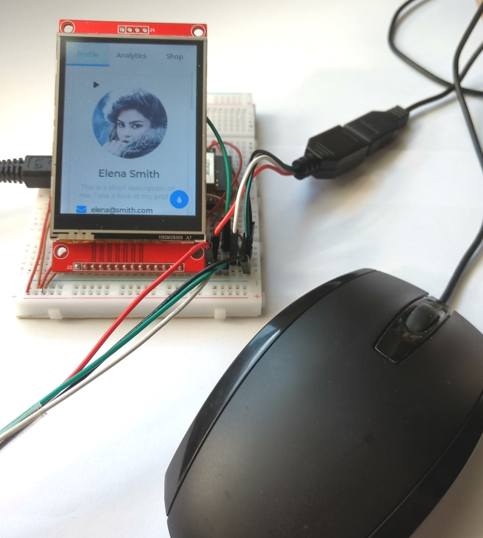

# LVGL + Touch Display + USB-Mouse or USB-keyboard

Tested with ESP32 DevKitC v4, ili9341 display and Arduino IDE 2.1.0 / PlatformIO

Display works with LVGL, TFT_eSPI by Bodmer or LovyanGFX

Details about display and installation is [here](/../Touch-Display-ili9341-320x240)

Details about display and installation is [here](../Touch-Display-ili9341-320x240)

## Connections for ESP32 DevKitC V4

Share SPI MOSI, MISO and CLK, so you need only 11 Pin's for 3 SPI devices.

| GPIO | USB   | TFT   | Touch | SD-Card | Description    |
| :--: | :---- | :---- | :---- | :------ | :------------- |
| 16   | DP_P0 |       |       |         | D+  ( green )  |
| 17   | DM_P0 |       |       |         | D+  ( white )  |
| 13   | DP_P3 |       |       |         | D+  ( green )  |
| 15   | DM_P3 |       |       |         | D+  ( white )  |
|      |       |       |       |         | 5V  ( red )    |
|      |       |       |       |         | GND ( black )  |
|------|-------|-------|-------|---------|----------------|
| 23   |       | SDI   | T_DIN | SD_MOSI | MOSI           |
| 19   |       |(SDO)  | T_DO  | SD_MISO | MISO           |
| 18   |       | SCK   | T-CLK | SD_SCK  | CLK            |
|  2   |       | DC    |       |         | DC             |
| EN   |       | RESET |       |         | RST            |
| 14   |       | CS    |       |         | CS  (TFT)      |
|  5   |       |       |       | SD_CS   | CS  (SD)       |
|  4   |       |       | T_CS  |         | CS  (Touch)    |
|      |       |       | T_IRQ |         | IRQ (not used) |
|      |       | GND   |       |         | GND            |
|      |       | VCC   |       |         | 3.3V           |
|      |       | LED   |       |         | 3.3V           |

## Install and configure the library TFT_eSPI 2.5.0 
- Default Windows Arduino folder : C:\Users\<username>\Documents\Arduino
- Edit the file : Arduino\libraries\TFT_eSPI\User_Setup.h ( [Link](/Arduino/libraries/TFT_eSPI/User_Setup.h) )
- Test : [TFT_graphicstest_PDQ_ili9341_Touch](/Arduino/TFT_graphicstest_PDQ_ili9341_Touch/TFT_graphicstest_PDQ_ili9341_Touch.ino) (works with TFT_eSPI or LovyanGFX)

