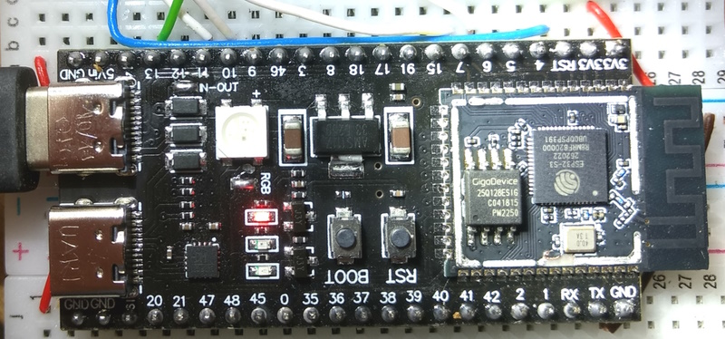

# ESP32-S3 + LVGL + Touch Display + USB-Mouse + USB-Keyboard

Tested with YD ESP32-S3 N16R8 ~9€ (similar to ESP32-S3-DevKitC-1) with an ili9341 display and Arduino IDE 2.1.0 ( PlatformIO ).

This test based on the test with an ESP32-DevKitC v4 [here](../README.md)





## Connections for YD ESP32-S3 

Share SPI - MOSI, MISO and CLK, so you need only 11 Pin's for 3 SPI devices.

| GPIO | USB   | TFT   | Touch | SD-Card | Description    |
| :--: | :---- | :---- | :---- | :------ | :------------- |
| 15   | DP_P0 |       |       |         | D+  ( green )  |
| 16   | DM_P0 |       |       |         | D-  ( white )  |
| 18   | DP_P1 |       |       |         | D+  ( green )  |
| 17   | DM_P1 |       |       |         | D-  ( white )  |
|      |       |       |       |         | 3.3V !  (red)  |
|      |       |       |       |         | GND ( black )  |
|------|-------|-------|-------|---------|----------------|
| EN   |       | RESET |       |         | RST            |
| 11   |       | SDI   | T_DIN |(SD_MOSI)| MOSI           |
| 13   |       |(SDO)  | T_DO  |(SD_MISO)| MISO           |
| 12   |       | SCK   | T-CLK |(SD_SCK) | CLK            |
|  7   |       | DC    |       |         | DC             |
| 10   |       | CS    |       |         | CS  (TFT)      |
|  6   |       |       | T_CS  |         | CS  (Touch)    |
|      |       |       |       | (SD_CS) | (not used)     |
|      |       |       | T_IRQ |         | IRQ (not used) |
|      |       | GND   |       |         | GND            |
|      |       | VCC   |       |         | 3.3V           |
|      |       | LED   |       |         | 3.3V           |

D+ and D- are directly connected to the GPIO's without using any resistor. SD-card is not used in this test. USB is connected to 3.3V instead of 5V. This was not intended, but some USB devices will work with it, so i kept it. GPIO9 and GPIO8 do also work with ESP32-USB-Soft-Host. 

One goal of this test was, to use the USB-OTG-Connector for usb devices, but GPIO19 and GPIO20 doesn't work here. The connector "usb-otg" on the back of this board is soldered, so usb devices get about 4.65V from the usb-uart connector via one diode. See [schematics](schematics/).

## Configure the Arduino IDE

| Arduino IDE         | My setup             | Remark |
| :------------------ | :------------------- | :- |
| Board               | ESP32S3 Dev Module   | |
| Port                | COM3                 | |
| --------------------| -------------------- | --------------------------------------- |
| USB CDC On Boot     | Disabled             | for upload and serial monitor on COM3 ! |
| CPU Frequency       | 240MHz (Wifi)        | |
| Core Debug Level    | None                 | |
| USB DFU On Boot     | Disabled             | |
| Erase All Flash ... | Disabled             | |
| Events Run On       | Core 1               | |
| Flash Mode          | QIO 80MHz            | |
| Flash Size          | 16MB (128Mbit)       | |
| JTAG Adapter        | Disabled             | so serial monitor stays on COM3 |
| Arduino Runs On     | Core 1               | |
| USB Firmare MSC ... | Disabled             | |
| Partition scheme    | 8M with spiffs ...   | |
| PSRAM               | Disabled             | |
| Upload Mode         | UART0 / Hardware CDC | upload on COM3 |
| Upload Speed        | 921600               | |
| USB Mode            | USB-OTG (TinyUSB)    | necessary for ESP32-USB-Soft-Host S2,S3 |

The lines with remark should be necessary for ESP32-USB-Soft-Host and the ESP32 S2 and S3. Using PlatformIO and esp32-s3-devkitc-1 there must be set the following flags in platformio.ini :
```
; don't use spaces in build_flags before and after the "=" !!!
build_unflags = 
  -D ARDUINO_USB_MODE=1         ; necessary for esp32-s3-devkitc-1.json
build_flags =
  -D ARDUINO_USB_MODE=0         ; 0= USB-OTG(TinyUSB), 1= Hardware USB CDC
  -D ARDUINO_USB_CDC_ON_BOOT=0  ; 0= upload and serial monitor on COM3
  -Wno-narrowing                ; disable [-Wnarrowing] errors 
```  

## Quick installation
- Arduino :
  - Install the libraries "lvgl", "TFT_eSPI" and "LovyanGFX".
  - Copy the program file(s) from the folder "Arduino/" and especially "Arduino/libraries/", which contain all configuration files and the library "ESP32-USB-Soft-Host-main" version 1.0.4 .
  - Copy the demos folder "Arduino\libraries\lvgl\demos" to "Arduino\libraries\lvgl\ **src**\demos"
  - Copy the examples folder "Arduino\libraries\lvgl\examples" to "Arduino\libraries\lvgl\ **src**\examples".
- PlatformIO :
  - Copy all files from the folder "PlatformIO/S3_LVGL_LovyanGFX_USB/" to your project folder.
  - PlatformIO should now install the missing libraries.
  - Copy the folder ".pio/libdeps/esp32-s3-devkitc-1/lvgl/demos" to ".pio/libdeps/esp32-s3-devkitc-1/lvgl/src/demos".
  - Copy the folder ".pio/libdeps/esp32-s3-devkitc-1/lvgl/examples" to ".pio/libdeps/esp32-s3-devkitc-1/lvgl/src/examples".

## Test programs

Some details about installation and configuration of the libraries LVGL, TFT_eSPI and LovyanGFX can be found [here](https://github.com/mboehmerm/Touch-Display-ili9341-320x240). All modified files can be found above in the folder [Arduino](Arduino/) or [PlatformIO](PlatformIO/). Version 0.1.4 of ESP32-USB-Soft-Host is used and must be copied e.g. from [here](PlatformIO/S3_LVGL_LovyanGFX_USB/.pio/libdeps/esp32-s3-devkitc-1/ESP32-USB-Soft-Host-main/)


- [S3_LVGL_TFT_eSPI_USB.ino](Arduino/S3_LVGL_TFT_eSPI_USB) ( [PlatformIO version](PlatformIO/S3_LVGL_TFT_eSPI_USB) does not work ).
  - Libraries needed : LVGL , TFT_eSPI and ESP32-USB-Soft-Host 0.1.4.
  - Mouse and all mouse buttons are working fine in LVGL.
  - Custom mouse cursor is shown (see comments in "Cursor_XXxXX.c" files).
  - Keyboard works except special keys ( äöü߀... ).
  - Mouse position x/y , buttons and Keyboard keys are shown in the serial monitor.
  
- [LVGL_Arduino_USB_Lovyan.ino](Arduino/S3_LVGL_Lovyan_USB) ( [PlatformIO version](PlatformIO/S3_LVGL_LovyanGFX_USB) ).
  - Version for the library LovyanGFX

The target of these programs is to find out how HID mice and keyboards can be used with an ESP32-S3. 

## Custom Boards and Partitions

Some informations can be found in the folders [AppData](AppData/) and [.platformio ](.platformio/)

## Problems

GPIO19 and GPIO20 does not work (yet?) with ESP32-USB-Soft-Host.

The PlatformIO version S3_LVGL_TFT_eSPI_USB does not work. Kernel panic. Why ?

There is a nice solution with Espressif IDF can be found here: 
https://www.youtube.com/watch?v=WPlPRkPx1_8&ab_channel=ThatProject

